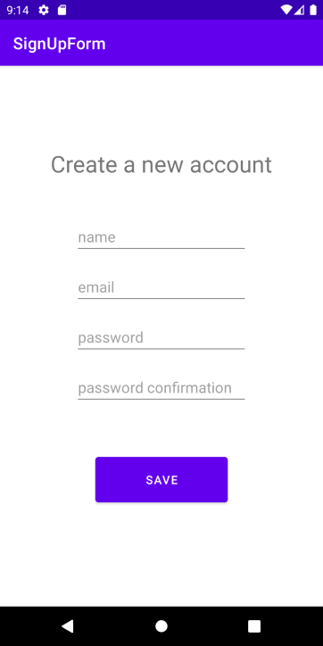

# SignUpForm
SignUpForm is a simple application that takes a name, email address, password, and a password confirmation from a new user. If any of the fields are empty when the user clicks the save button, then any empty fields show an error. Another error check confirms that the password and password confirmation truly match, if they do not the user gets an error at the password confirmation field. If there are no issues with information provided by user, a toast message welcomes them.

### App on start
 
